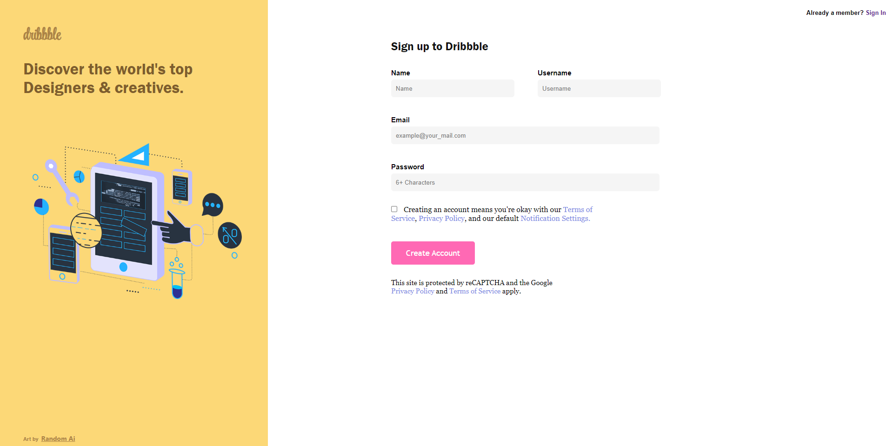
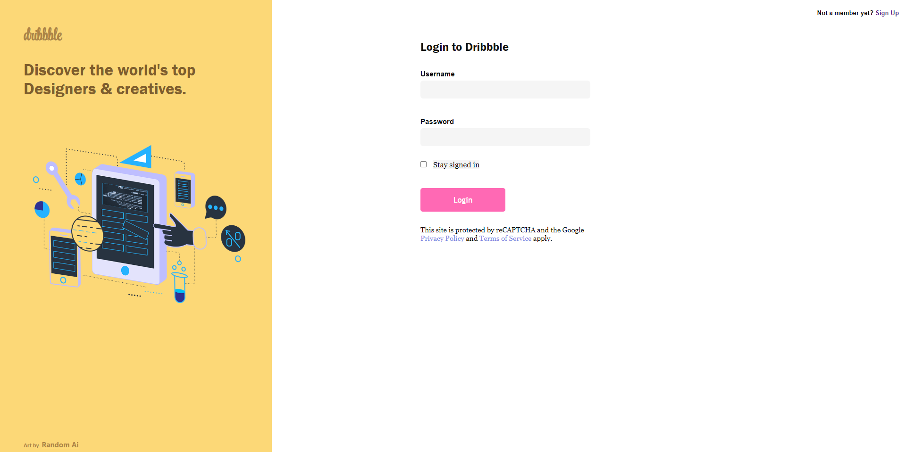
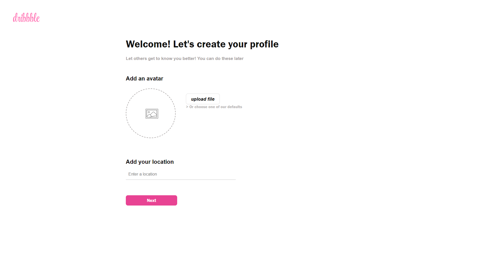
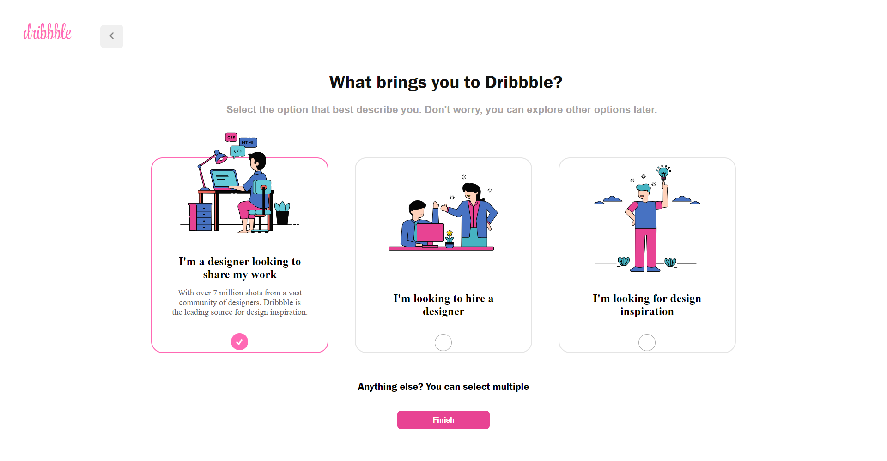
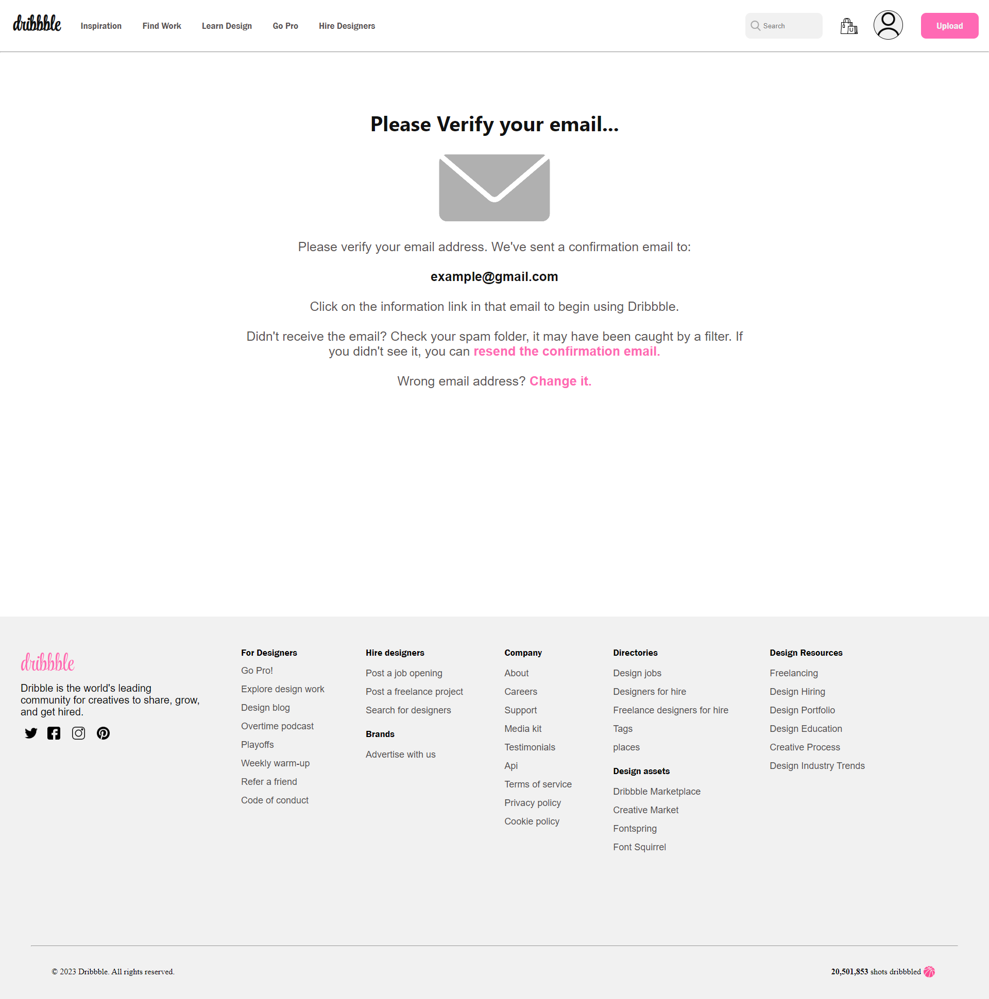

<h2>Welcome to Dribsite</h2>

This is my personal project that I made to understand the fundamentals of HTML, CSS and JavaScript. 

Here are some Screenshots to give you an example of how the site looks as well as the link to the live page where you can interact with the website.

<a href="https://zolaontop1.github.io/dribsite/"> 

<h3>Signup Page</h3>

<h3>Login Page</h3>

<h3>Profile Page</h3>

<h3>Customize Page</h3> 

<h3>Mainpage</h3>

